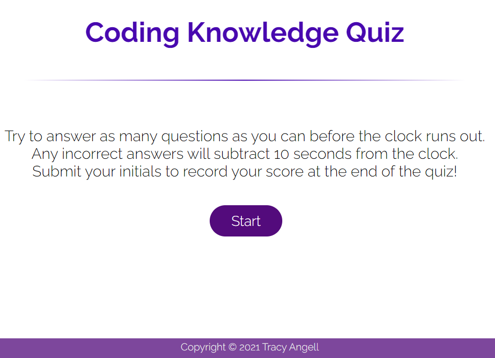
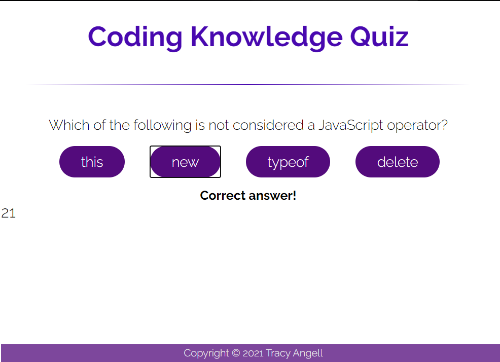
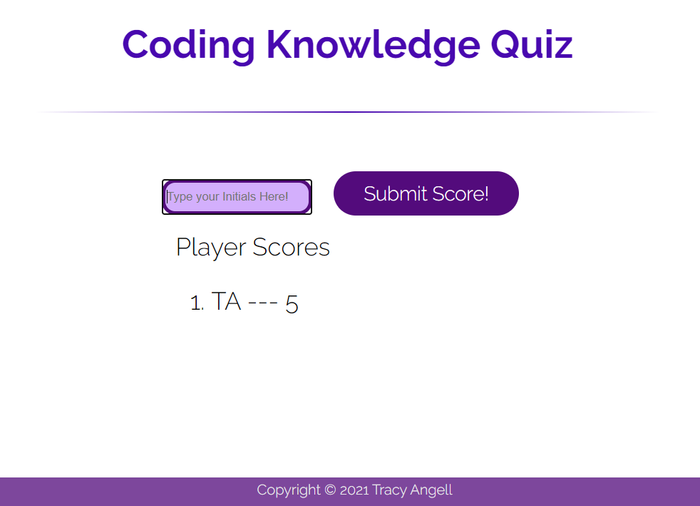

# Timed Coding Knowledge Quiz

Creation of a webpage that contains a timed, multipule choice quiz based on the subject matter knowledge of coding. 
***
Site Created using: 
- HTML
- CSS
- JS
***
The player will be provided with basic instructions and terms of the game and click Start to begin the quiz.

Each question has multiple choice options and the player will be provided with feedback on if the choice they selected was correct or incorrect.

If the player runs out of time or runs out of questions the quiz will end and they will be prompted to enter their initials and submit them to be reflected on the Player Scores list which will appear on the lower portion of the screen.

***
[Coding Knowledge Quiz](https://tracye1083.github.io/Homework-Week-04/)
***
**CONTACT INFORMATION**

Tracy Angell, can be contacted via <a href="https://github.com/tracye1083">GitHub</a>
